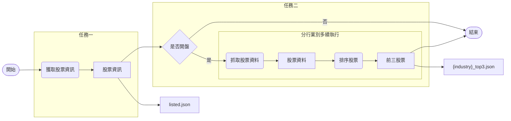

# TWSTOCK

抓取台股每日各產業別漲幅前三名股票

資料來源: 
* [台股上市證券代號及名稱](https://isin.twse.com.tw/isin/C_public.jsp?strMode=2)
* [每日收盤價](https://www.twse.com.tw/en/page/trading/exchange/STOCK_DAY.html)


## 使用方式

### 在本地端執行

先決條件

* Git
* Python 3.9

執行

```
$ git clone https://github.com/yuchio8156/twstock
$ cd twstock
$ pip install -r requirements.txt
$ python run.py
```

<h3 id="deploy">使用 Docker 進行部屬</h3>

先決條件

* docker
* docker-compose

執行

```
$ git clone https://github.com/yuchio8156/twstock
$ cd twstock
$ docker-compose up
```

輸出結果會在根目錄以執行日期 `yyyymmdd` 創建資料夾並將 `listed.json` 與 `{industry}_top3.json` 保存其中

提醒: 若欲使用代理伺服器服務，可至 `.env` 修改帳號及密碼並設置 `USE_PROXY=TRUE`


## 流程架構




## 實作說明

目前已完成最小可行性產品的開發

在使用多執行續的情況下，完成一次完整任務的花費時間大約落在一分鐘左右

專案要求股票資訊與產業別收盤漲幅前三名之股票

考量未來擴展性，各項任務都盡量以一般化的思維去做設計

底下逐一說明各項任務的安排規劃


### 測試

首先是測試

本來較少接觸自動化測試這塊

在做了一些功課後決定採用測試驅動開發

因此在專案底下的程式都是先有測試用例才有後續的開發和優化


### 程式

主要結構如下
```
├── .env
├── run.py
└── twstock
    ├── config.py
    ├── logger.py
    ├── proxy.py
    ├── sorter.py
    ├── stock_data_crawler.py
    ├── stock_info_crawler.py
    └── tasker.py
```

<details>
    <summary>
        <code>
            <a href="https://github.com/yuchio8156/twstock/blob/main/.env" target="_blank">
                .env
            </a>
        </code>
    </summary>
    <b>環境變數</b>
    <p>用來存放機密性較高的資訊，目前僅用來放置代理伺服器的設定</p>
</details>

<details>
    <summary>
        <code>
            <a href="https://github.com/yuchio8156/twstock/blob/main/twstock/config.py" target="_blank">
                config.py
            </a>
        </code>
    </summary>
    <b>常數變數</b>
</details>

<details>
    <summary>
        <code>
            <a href="https://github.com/yuchio8156/twstock/blob/main/twstock/logger.py" target="_blank">
                logger.py
            </a>
        </code>
    </summary>
    <b>管理日誌</b>
</details>

<details>
    <summary>
        <code>
            <a href="https://github.com/yuchio8156/twstock/blob/main/twstock/proxy.py" target="_blank">
                proxy.py
            </a>
        </code>
    </summary>
    <b>生成代理</b>
    <p>
        使用 <a href="https://free-proxy-list.net/" target="_blank">Free Proxy List</a> 搭配 <code>stock_data_crawler.py</code> 的 <code>visit()</code> 函數來生成可用於 TWSE 的代理
    </p>
    <p>原先此功能預計放在多續執行時，每個執行續各搭配一組，但生成時間過久且代理可用率過低，最後未實裝於專案中</p>
</details>

<details>
    <summary>
        <code>
            <a href="https://github.com/yuchio8156/twstock/blob/main/twstock/sorter.py" target="_blank">
                sorter.py
            </a>
        </code>
    </summary>
    <b>排序功能</b>
    <p>計算股票漲跌幅並排序取前 n 大者</p>
    <p>邏輯已考慮目標網頁特殊資料型態，如 "X0.00" 和 "\-\-"</p>
</details>

<details>
    <summary>
        <code>
            <a href="https://github.com/yuchio8156/twstock/blob/main/twstock/stock_data_crawler.py" target="_blank">
                stock_data_crawler.py
            </a>
        </code>
    </summary>
    <b>股票資料爬蟲</b>
    <p>輸出結果包含股票的所有資料（開高收低等），便於往後有類似的需求時，可以直接引用此模組</p>
    <p>本次爬取是透過英文版的頁面，原因是不喜歡程式內中英文混雜，其次是不想多費工夫處理民國年和後續可能引發的編碼問題</p>
    <p>另外導入自己慣用的工具，使用 session 與 cookie 來模擬正常訪問網頁的動作，管理 header 便於以後同個網站下不同 request 情境的使用</p>
</details>

<details>
    <summary>
        <code>
            <a href="https://github.com/yuchio8156/twstock/blob/main/twstock/stock_info_crawler.py" target="_blank">
                stock_info_crawler.py
            </a>
        </code>
    </summary>
    <b>股票資訊爬蟲</b>
    <p>同上，但該網站使用案例相對單純（只有拿一次資料），就沒有導入額外工具</p>
</details>

<details>
    <summary>
        <code>
            <a href="https://github.com/yuchio8156/twstock/blob/main/twstock/tasker.py" target="_blank">
                tasker.py
            </a>
        </code>
    </summary>
    <b>任務管理</b>
    <p>分別打包<b>股票資料爬蟲</b>和<b>股票資訊爬蟲</b>成符合此專案需求的函數</p>
    <p>於股票資料爬蟲執行前，加入當日是否開盤的判斷，防止所有資料都爬完之後才發現沒有當日股價</p>
</details>

<details>
    <summary>
        <code>
            <a href="https://github.com/yuchio8156/twstock/blob/main/run.py" target="_blank">
                run.py
            </a>
        </code>
    </summary>
    <b>主程式</b>
    <p>導入 <code>tasker.py</code> 的兩個函數使用並加入 cronjob 進行排程管理</p>
</details>


### 部屬

已完成的部屬方法[如上](#deploy)

設計目前架構時，有同時思考擴展服務和更進一步的上線使用

目前的解法可以遷移本專案到該環境並 `import twstock` 獲取主要的兩個任務函數：`get_stock_info()` 和 `get_top_stock()` 再因目的地不同做後續處理


接下來想到的方案是放到 Airflow 或 AWS Lambda 上進行託管並執行

\- 於 Airflow，可以把 `config.py` 中的設置放到 Variable 集中管理，兩個任務之間的溝通可以透過 XComs，排程管理、日誌紀錄和儲存系統的連接也都可以使用 Airflow 的現成工具去設定

\- 於 AWS lambda，也可以把設置放到環境變數中，任務管理的話可以先設定每天固定時間執行 `get_stock_info()` 再透過 json file 落在 S3 的事件驅動 `get_top_stock()`，日誌管理的功能就不太熟悉了，但目前的專案內就已有這部分，應該不需要多費功夫。

若僅考量熟悉程度，我會採取 Airflow 的作法，但綜合考量之下，如專案規模和遷移速度，擇 AWS Lambda 我想會是較好的方式
